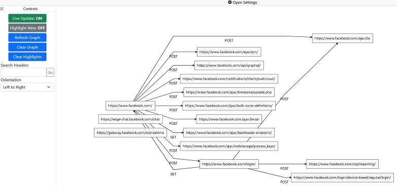

# Referer Graph

Visualize the directed graph of HTTP "Referer" headers. See [demo video](https://raw.githubusercontent.com/psalire/Referer-Graph/main/demo.mp4)



## How to Install

Referer Graph is comprised of 3 parts that work together sequentially:

1. Burp Suite extension
2. Node.js server
3. Web application

Required:
```
Node.js (version 14 recommended)
Java    (version 11 recommended)
```

### 1. Building the Web App
```
npm install       # Install dependencies
npm run build-all # Build the web app
```

### 2. Building the Burp extension .jar

Download the jar from [releases](https://github.com/psalire/Referer-Graph/releases/tag/jar). Alternatively, build the jar locally.

#### Building the jar locally

Navigate to the `burp/` directory and run:
```
gradle shadowJar
```

`burp-extension-web-app-flow-visualizer-all.jar` is created in directory `build/libs/` if successful.

Note: Gradle version 6.9 is recommended; the gradle build file may not work with other versions.

## How to Use

Use the following steps to get everything up and running:

1. Run `npm start` in the base directory to start the web-app server
2. Import the `burp-extension-web-app-flow-visualizer-all.jar` to Burp Extender
3. In the "Referer Graph" tab in Burp Suite, setup the configuration to your use case
4. Navigate to `http://localhost:8000` to access the visualization web-app

## TODO

- Parse URL query strings
  - Query parameters shouldn't be treated as part of the unique URL 

## Troubleshooting

### Extension fails to connect to web-app

Make sure that Node.js and Java are allowed to make connections in your firewall settings.
